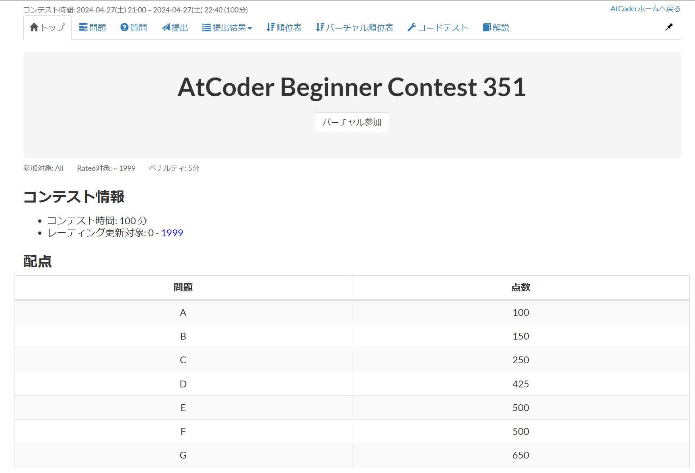
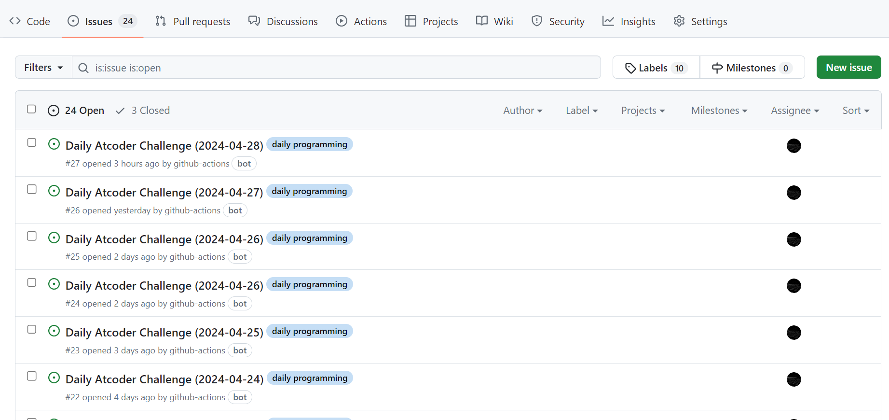
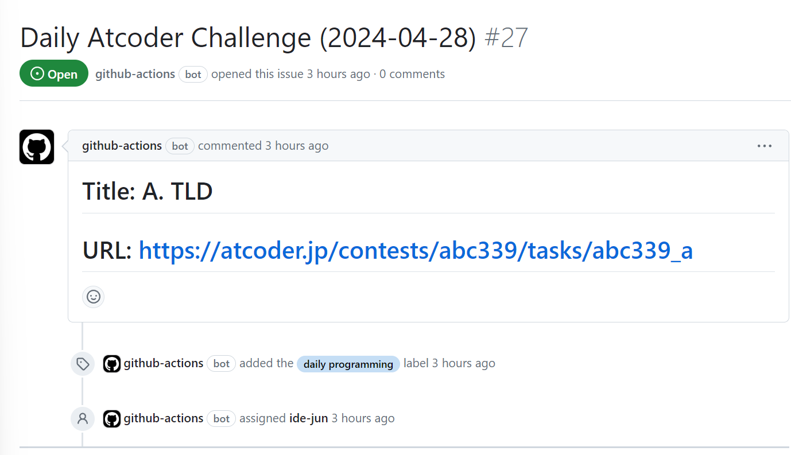
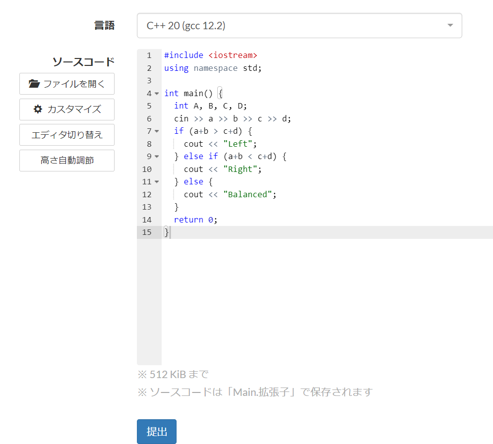
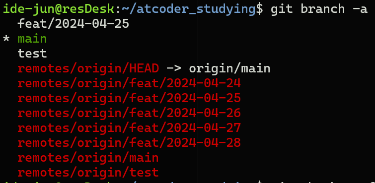
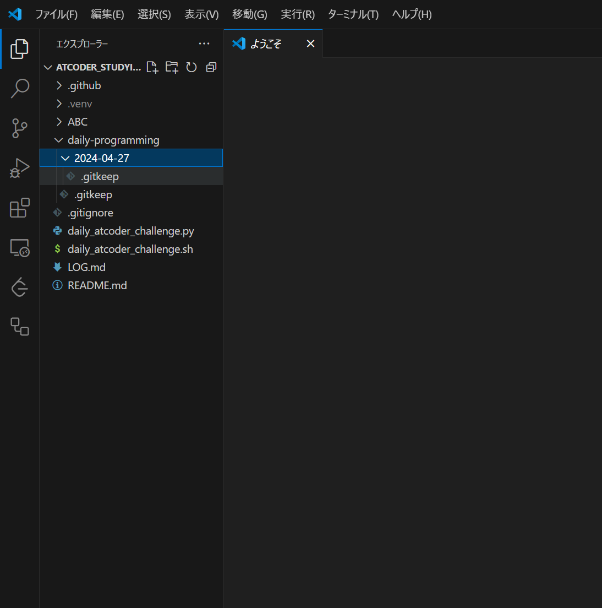
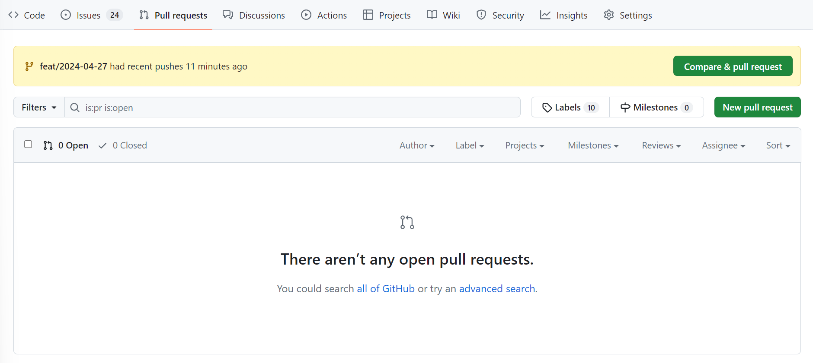
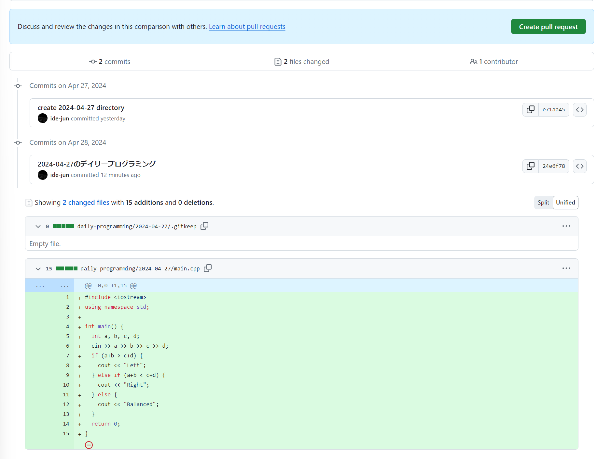
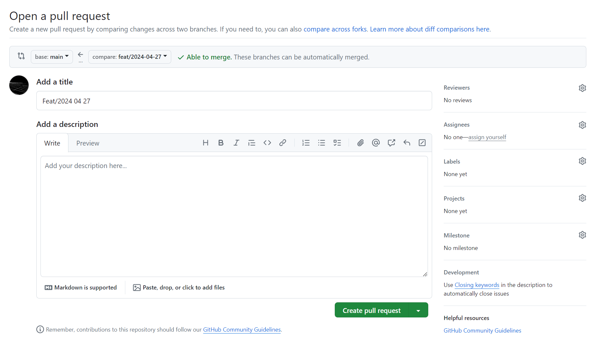
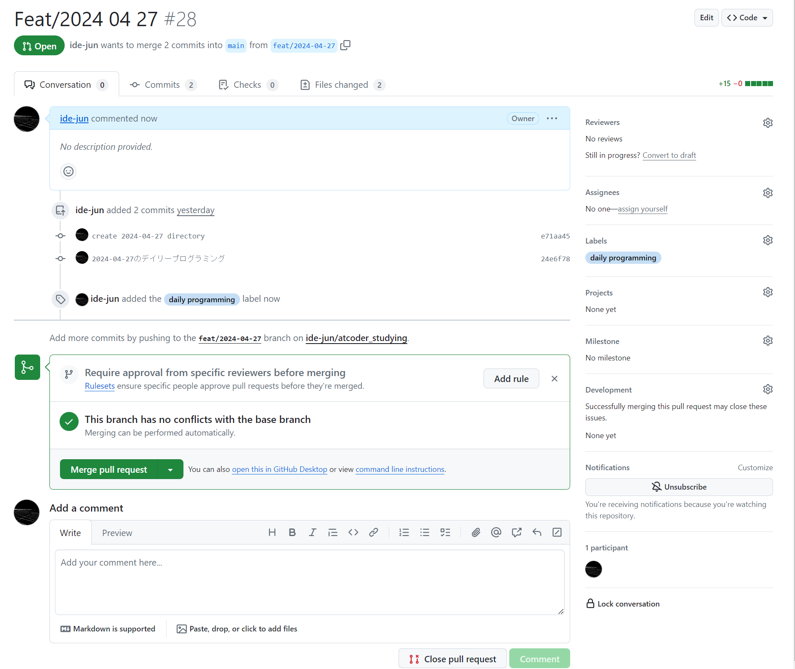

# 概要
このリポジトリは`C`, `C++`の勉強用リポジトリです。
また、それと同時に`git`, `GitHub`の操作方法を学べればよいと考えています。
# デイリープログラミングについて
まず`C++`の一般的な書き方を覚えてもらうため、AtcoderのABCのA問題を解いてもらいます。
## ABCとは？
ABCとは、「Atcoder Beginner Contest」の略です。
毎週金曜日や土曜日に開催されています。

その中でもA問題は最も難易度が低く、「標準入力を受け取り、単純な演算をして標準出力できるかどうか」程度のレベルです。書き方を覚えるにはちょうど良いかなと思います。
## 解き方について
毎週月曜から金曜の12時に過去開催されたABCの中から、ランダムにA問題を取ってくるようにしました。
手順は以下の通りです。
1. 作成されたissueの中から、今日の日付のものを開く

    
2. 開いたら、URLが貼られているのでクリック

    
3. Atcoder Beginner Contest ooo のA問題のページに行くので、ログインして問題を読む

    
4. 回答欄で「C++ 20(gcc 12.2)」を選択して問題を解いて「提出」する（C++ のgccであればよい）。

    
5. 提出した問題はAtcoderのサイト上で採点されます。結果」が`AC`になったら問題を解けたという扱いになります。期待する出力を導き出せていない場合には`WA`, コンパイルエラーの場合には`CE`が出ます。

    
6. `AC`になったら、該当日付のブランチ（`feat/YYYY-MM-DD`）に移動し、該当フォルダ内に提出したコードと同じcppファイルを作成し、コミット、プッシュしてください。（詳細は以下）

## ブランチ移動からプッシュまでの流れ
コマンドベースで説明します。
1. `git pull`をする
2. `git branch -a`で解いた問題の日付と対応するブランチがあるかどうか確認する。

    
3. `git checkout feat/<日付>`でブランチを移動

    
4. `git branch`でブランチを移動できているか確認（ハイライトがついてるとこが今いるブランチ）

    
5. VSCodeでリポジトリの中身を確認すると、`daily-programming/<日付>`が作成されているため、その中に`main.cpp`ファイルを作成し、提出したコードを張り付ける。

    
6. 貼り付けたら`git status`で状態を確認

    
7. 赤字で書かれているファイルは現状、追跡対象外になっているため、`git add *`で追跡対象に含めさせる。  
再度`git status`で状態を確認。緑字になっていればOK

    

8. `git commit -m "<コメント>"`でコミットする。コメントは分かればなんでもOK

    
9. `git push`でプッシュ！ここまで出来たら、今度は以下の手順でプルリクエストの作成をしてほしいです。

    

## プルリクエストの作成
GitHubのリポジトリページで作成します。
1. 「Pull requests」タグを選択し、「New pull request」ボタンを押す

    

2. 矢印の出元を、作業したブランチ（`feat/<日付>`）にする。

    
    
    そうすると以下のような画面になるため、「Create pull request」ボタンを押す。

    
3. 以下の画面で右端の「Reviewers」を`ide-jun`、「Assignees」を`Ryot-Kawa`、「Labels」を`daily programming`にし、「Create pull request」を押す。

    
4. 以下みたいに出来たらOK! 自分がレビューします（issueやプルリクエストについてはまた今度詳しく教えます）。
    
    